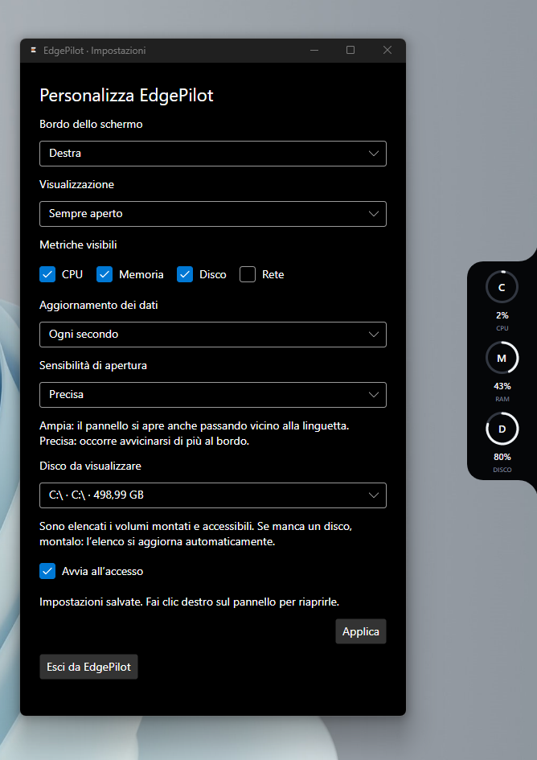
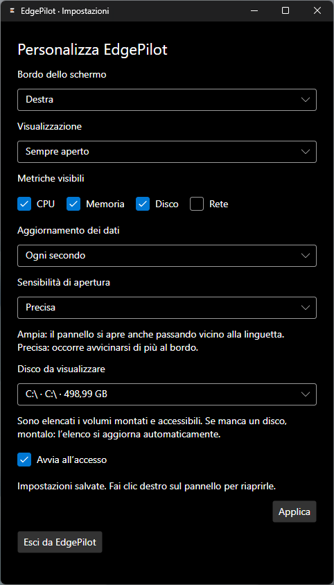

<p align="center">
  
</p>

<h1 align="center">EdgePilot</h1>
<p align="center">Your system, one screen edge away.</p>
<p align="center">A compact desktop system monitor for Windows and Linux.</p>

[](https://github.com/pricootz/edgepilot/actions/workflows/build.yml)
[](LICENSE)

**Early preview — v0.1.** EdgePilot unfolds from the edge of your screen to show local system activity. No account or server is required. The application interface is currently **Italian**; repository documentation is in English.

## See it in action

<p align="center">
  
</p>
<p align="center">Windows 11 · Settings and expanded notch.</p>

<table>
<tr><th>Settings</th><th>Expanded notch</th><th>Collapsed pill</th></tr>
<tr>
<td valign="top"></td>
<td valign="top"></td>
<td valign="top"></td>
</tr>
</table>

These are real, unaltered Windows 11 screenshots supplied by the maintainer. The application interface is Italian; CPU, memory and disk are enabled in these captures. Ubuntu screenshots are still to come.

## What works today

- Live CPU and memory usage, disk capacity, network download/upload rates.
- Details for the network interface, uptime, host and operating system.
- Rounded collapsed pill, spring motion, hover expansion, delayed folding and click-to-pin.
- Placement on any of the four screen edges, with upright metric labels.
- Persistent display modes, visible metrics, refresh interval and hover sensitivity.
- Persistent disk selection by volume path; an unavailable disk is not silently replaced.
- System light/dark theme in Linux settings, subject to desktop support.
- Tray menu, optional start at login, per-user installation and single-instance activation.
- Windows and Ubuntu CI builds, UX checks, packaged launch and installation checks.

## Download and install

Use the [Releases page](https://github.com/pricootz/edgepilot/releases) for published previews. **If it is empty, a release has not been published yet.**

For development builds, open a successful [build workflow](https://github.com/pricootz/edgepilot/actions/workflows/build.yml), then download **EdgePilot-win-x64** or **EdgePilot-linux-x64** under *Artifacts*. Artifact downloads require a GitHub sign-in and expire after 30 days. Unpack the artifact, then unpack the application archive inside it.

Packages include the .NET runtime; no SDK is needed. See the [installation guide](packaging/README.md) for running, installing, upgrading and removing EdgePilot.

## Quick start from source

Install the .NET 10 SDK and use a graphical Windows or Linux desktop:

```bash
git clone https://github.com/pricootz/edgepilot.git
cd edgepilot
dotnet run --project src/EdgePilot/EdgePilot.csproj -c Release -- --settings
```

Right-click the notch to open settings. **Applica** saves changes; **Esci** exits. Starting EdgePilot again opens the settings of the running instance.

To build and run the executable regression suite:

```bash
dotnet build src/EdgePilot/EdgePilot.csproj -c Release
dotnet run --project tests/EdgePilot.UxChecks -c Release
```

## Preview limitations

- Current packages target **x64**. macOS, ARM packages and headless SSH sessions are not supported targets.
- Linux transparency, positioning and tray visibility depend on the desktop/compositor. A GNOME AppIndicator extension may be needed.
- Linux settings use Avalonia controls and system theme information, not native GTK/Yaru widgets.
- Display scaling, multiple monitors and login behavior need broader real-desktop testing.
- Disk selection follows a drive letter or mount path, not a hardware serial number.
- Network interface selection is automatic. Temperatures, GPU and fan readings are not implemented.
- Packages are unsigned and updates are manual. This is not yet a stable release.

## Privacy

Metrics are sampled on the local computer. The app has no account, cloud backend or telemetry uploader. Settings are stored in the user's application-data folder. Screenshots and diagnostics may reveal hostnames, disk labels or paths: review them before attaching them to an issue.

## Documentation and contributing

- [Settings](docs/SETTINGS.md) · [Desktop integration](docs/DESKTOP-INTEGRATION.md)
- [Architecture](docs/ARCHITECTURE.md) · [Product scope](docs/PRODUCT.md) · [Roadmap](docs/ROADMAP.md)
- [Contributing](CONTRIBUTING.md) · [Security](SECURITY.md) · [Changelog](CHANGELOG.md)
- [Release checklist](docs/RELEASING.md) · [Brand assets](docs/BRANDING.md)

Found a problem? [Open an issue](https://github.com/pricootz/edgepilot/issues/new/choose) with your OS, desktop session and reproduction steps.

## License

[MIT](LICENSE). Third-party software retains its own licenses; see [THIRD-PARTY-NOTICES.md](THIRD-PARTY-NOTICES.md).
