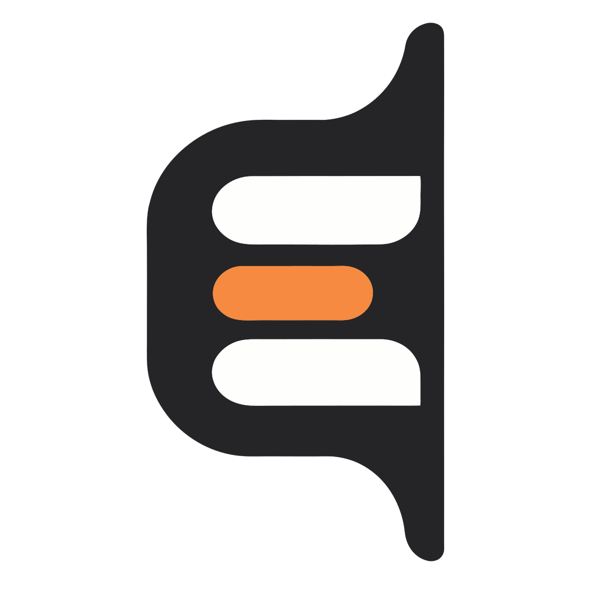
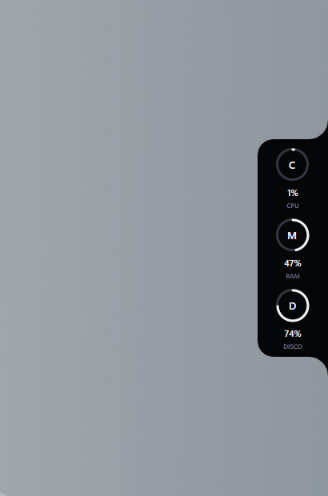

<p align="center">
  
</p>

<h1 align="center">EdgePilot</h1>
<p align="center"><strong>Your desktop has edges. EdgePilot makes them useful.</strong></p>
<p align="center">An edge-native desktop surface for Windows and Linux.</p>

[](https://github.com/pricootz/edgepilot/actions/workflows/build.yml)
[](LICENSE)

**v0.2 preview.** EdgePilot lives at the edge of the desktop and stays out of the way until it is useful. The current System module surfaces live local machine activity; the project is evolving toward contextual signals and actions that appear only when they matter.

No account, server or telemetry uploader is required. The interface ships in **Italian, English and French**, follows the system language automatically, and can be extended with additional locale files.

<p align="center">
  
</p>
<p align="center">The current System module running from the screen edge.</p>

## v0.2 at a glance

- Redesigned responsive Settings experience with dedicated **General, Edge, Monitor, Behavior, Startup and About** sections.
- General page for interface language and Settings appearance (`System`, `Light`, `Dark`).
- Interactive metric cards and contextual options: disabling Disk also hides its volume selector.
- IT / EN / FR localization across Settings, tray, tooltips, installer messages and persisted preferences.
- Translator-friendly locale architecture under `Assets/Locales`: new languages are contributed as JSON files instead of C# catalog edits.
- Safe locale fallback and backward-compatible migration from the first v0.2 language preferences.
- Direct rendering of the canonical EdgePilot SVG in the app; Windows keeps a generated native ICO.
- Clear product identity, author attribution and GitHub links in About.
- Settings code split into shell, pages and reusable controls so future modules do not turn one window into a monolith.
- Dedicated localization regression checks in addition to the existing Windows/Ubuntu UX and packaging CI.

## What works today

- Live CPU and memory usage, disk capacity, and network download/upload rates.
- Details for the network interface, uptime, host and operating system.
- Rounded collapsed pill, spring motion, hover expansion, delayed folding and click-to-pin.
- Placement on any of the four screen edges, with upright metric labels.
- Persistent display modes, visible metrics, refresh interval, hover sensitivity, language, Settings appearance and disk selection.
- Responsive Settings UI; Settings can follow the system theme or use an explicit light/dark choice.
- Tray menu, optional start at login, per-user installation and single-instance activation.
- Windows and Ubuntu CI builds, UX checks, localization checks, packaged launch and installation checks.
- Local-first operation: no account, required cloud backend or telemetry uploader.

## Next: Signals

The next product step is **ambient Signals**: short-lived, context-aware events that temporarily take over the edge instead of behaving like traditional notifications.

The first planned signals are intentionally small and reliable:

- Internet connection lost / restored.
- Low disk space.
- Sustained unusual CPU activity.

The design goal is simple: **you should not have to open EdgePilot to discover that something important happened.**

## Download and install

Use the [Releases page](https://github.com/pricootz/edgepilot/releases) for published previews. If it is empty, a release has not been published yet.

For development builds, open a successful [build workflow](https://github.com/pricootz/edgepilot/actions/workflows/build.yml), then download **EdgePilot-win-x64** or **EdgePilot-linux-x64** under *Artifacts*. Artifact downloads require a GitHub sign-in and expire after 30 days.

Packages include the .NET runtime; no SDK is needed. See the [installation guide](packaging/README.md) for running, installing, upgrading and removing EdgePilot.

## Quick start from source

Install the .NET 10 SDK and use a graphical Windows or Linux desktop:

```bash
git clone https://github.com/pricootz/edgepilot.git
cd edgepilot
dotnet run --project src/EdgePilot/EdgePilot.csproj -c Release -- --settings
```

Right-click the notch or use the tray menu to open Settings. Changes remain pending until **Save changes** is pressed. Starting EdgePilot again activates the already-running instance instead of launching a duplicate.

To build and run the regression suites:

```bash
dotnet build src/EdgePilot/EdgePilot.csproj -c Release
dotnet run --project tests/EdgePilot.UxChecks -c Release
dotnet run --project tests/EdgePilot.LocalizationChecks -c Release
python scripts/check_repository.py
```

## Preview limitations

- Current packages target **x64**. macOS, ARM packages and headless SSH sessions are not supported targets.
- Linux transparency, positioning and tray visibility depend on the desktop/compositor. A GNOME AppIndicator extension may be needed.
- Display scaling, multiple monitors and login behavior still need broader real-desktop testing.
- Disk selection follows a drive letter or mount path, not a hardware serial number.
- Network interface selection is automatic. Temperatures, GPU and fan readings are not implemented.
- Packages are unsigned and updates are manual. This is not yet a stable release.

## Privacy

Metrics are sampled on the local computer. Settings are stored in the user's application-data folder. EdgePilot currently has no account, required cloud backend or telemetry uploader. Screenshots and diagnostics may reveal hostnames, disk labels or paths: review them before attaching them to an issue.

## Project and contributing

EdgePilot is created and primarily maintained by [@pricootz](https://github.com/pricootz).

The IT / EN / FR localization foundation was contributed by [@IamArayel](https://github.com/IamArayel) through [PR #5](https://github.com/pricootz/edgepilot/pull/5) and reconciled with the v0.2 Settings architecture.

The file-based locale architecture, translator workflow, fallback strategy and localization validation ideas were contributed by [@ArnieGA](https://github.com/ArnieGA) through [PR #8](https://github.com/pricootz/edgepilot/pull/8) and reconciled without dropping the French localization or the current Settings design.

- [Settings](docs/SETTINGS.md) · [Desktop integration](docs/DESKTOP-INTEGRATION.md) · [Translating](docs/TRANSLATING.md)
- [Architecture](docs/ARCHITECTURE.md) · [Product scope](docs/PRODUCT.md) · [Roadmap](docs/ROADMAP.md)
- [Contributing](CONTRIBUTING.md) · [Security](SECURITY.md) · [Changelog](CHANGELOG.md)
- [Release checklist](docs/RELEASING.md) · [Brand assets](docs/BRANDING.md)

Found a problem? [Open an issue](https://github.com/pricootz/edgepilot/issues/new/choose) with your OS, desktop session and reproduction steps.

## License

[MIT](LICENSE). Third-party software retains its own licenses; see [THIRD-PARTY-NOTICES.md](THIRD-PARTY-NOTICES.md).
